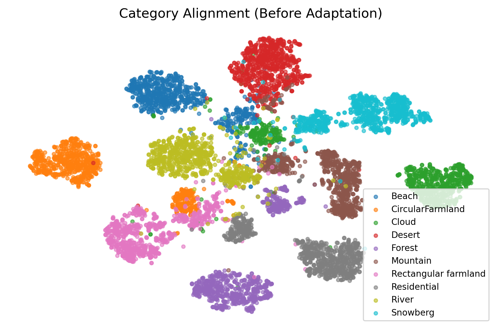
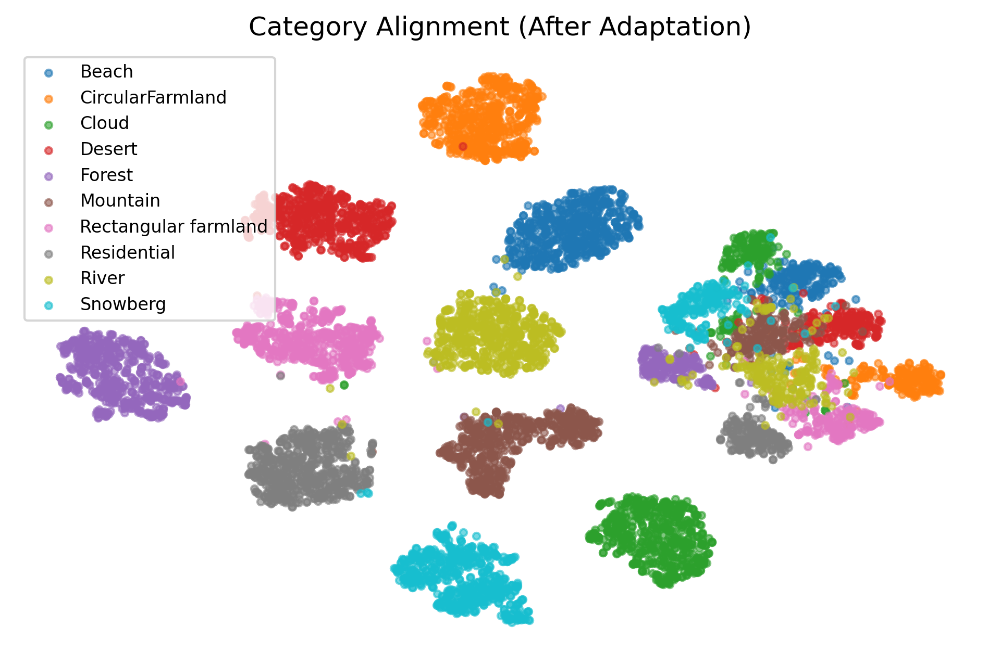
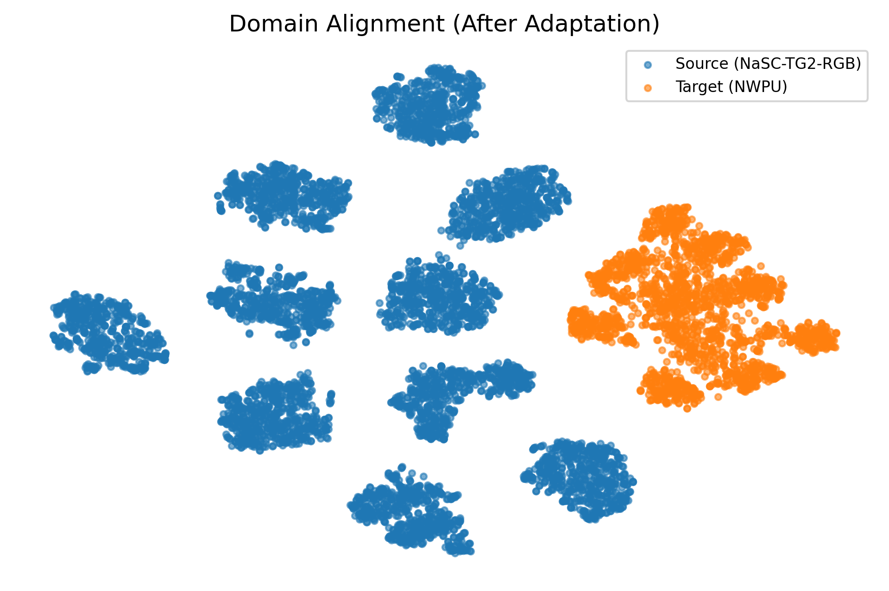
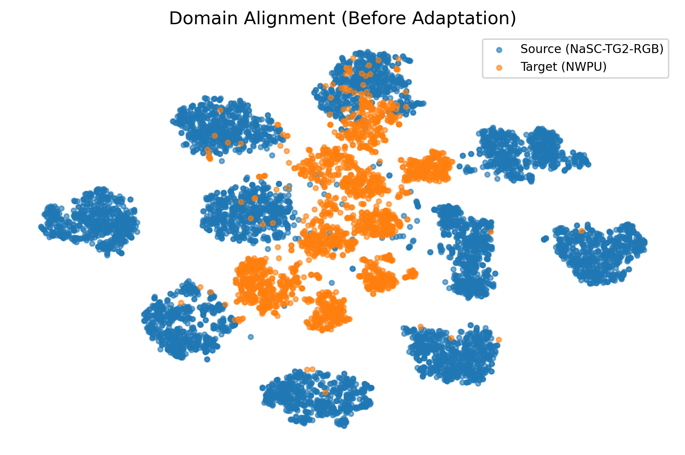

## CAB-SFDA 
This repository contains the implementation of "Class-Aware Balanced Source-Free Domain Adaptation for Remote Sensing Scene Classification" paper. 

Our paper suggests a novel technology for source-free domain adaptation on small datasets. This technology integrates class-balanced memory, prototype attraction, weak/strong consistency, and information maximization with a frozen classifier in a source-free setting to tackle the challenges of domain shift in Remote Sensing (RS) scene classification.
## Results
| Datasets | AID | CLRS | MLRSN | RSSCN7 | 
| -------- | ----------- | ----------- | ----------- |-----------|
| AID -> | - | 91.27 | 85.97 |81.90|
| CLRS ->  | 95.48 | - | 87.97 |85.95|
| MLRSN -> | 87.55 | 84.96 | - |84.88|
| RSSCN7 -> | 94.39  | 91.11 | 96.48  |-|

The figure below shows the t-SNE visualization of remote sensing datasets, specifically the transfer from NWPU-RESISC45 to NaSC-TG2, where NWPU-RESISC45 is used as the source domain and NaSC-TG2 as the target domain. This figure illustrates a representative example of the obtained results.
<p align="center">
  
  
  
  
</p>

## Datasets
Our paper assesses performance on 12 transfer tasks using the cross-scene dataset, as well as two transfer tasks utilizing the cross-sensor dataset.
#### Cross-scene dataset
* AID <-> CLRS
* AID <-> MLRSN
* AID <-> RSSCN7
* CLRS <-> MLRSN
* CLRS <-> RSSCN7
* MLRSN <-> RSSCN7
#### Cross-sensor dataset
* NWPU-RESISC45 <-> NaSC-TG2
* WHU-RS19 <-> EuroSAT
#### Shared classes
The tables below summarize the shared classes among all considered datasets and their corresponding label assignments.
<table width="100%">
<tr>

<td valign="top" width="33%">

<b>AID, CLRS, MLRSN,and RSSCN7</b>
<table>
<tr><th>Shared</th><th>AID</th><th>CLRS</th><th>MLRSN</th><th>RSSCN7</th></tr>
<tr><td>Farmland</td><td>Farmland</td><td>farmland</td><td>farmland</td><td>Field</td></tr>
<tr><td>Forest</td><td>Forest</td><td>forest</td><td>forest</td><td>Forest</td></tr>
<tr><td>Industrial</td><td>Industrial</td><td>industrial</td><td>industrial_area</td><td>Industry</td></tr>
<tr><td>Meadow</td><td>Meadow</td><td>meadow</td><td>meadow</td><td>Grass</td></tr>
<tr><td>Parking</td><td>Parking</td><td>parking</td><td>parking_lot</td><td>Parking</td></tr>
<tr><td>Residential</td><td>DenseResidential</td><td>residential</td><td>dense_residential_area</td><td>Resident</td></tr>
<tr><td>River</td><td>River</td><td>river</td><td>river</td><td>River</td></tr>
</table>

</td>

<td valign="top" width="33%">

<b>NWPU-RESISC45 and NaSC-TG2</b>
<table>
<tr><th>Shared</th><th>NWPU</th><th>NaSC</th></tr>
<tr><td>Beach</td><td>beach</td><td>beach</td></tr>
<tr><td>Circular Farmland</td><td>circular_farmland</td><td>circularfarmland</td></tr>
<tr><td>Cloud</td><td>cloud</td><td>cloud</td></tr>
<tr><td>Desert</td><td>desert</td><td>desert</td></tr>
<tr><td>Forest</td><td>forest</td><td>forest</td></tr>
<tr><td>Mountain</td><td>mountain</td><td>mountain</td></tr>
<tr><td>Rectangular Farmland</td><td>rectangular_farmland</td><td>rectangularfarmland</td></tr>
<tr><td>Residential</td><td>dense_residential</td><td>residential</td></tr>
<tr><td>River</td><td>river</td><td>river</td></tr>
<tr><td>Snowberg</td><td>snowberg</td><td>snowberg</td></tr>
</table>

</td>

<td valign="top" width="33%">

<b>WHU-RS19 and EuroSAT</b>
<table>
<tr><th>Shared</th><th>WHU-RS19</th><th>EuroSAT</th></tr>
<tr><td>Farmland</td><td>Farmland</td><td>AnnualCrop</td></tr>
<tr><td>Forest</td><td>Forest</td><td>Forest</td></tr>
<tr><td>Industry</td><td>Industrial</td><td>Industrial</td></tr>
<tr><td>Meadow</td><td>Meadow</td><td>Pasture</td></tr>
<tr><td>Residential</td><td>Residential</td><td>Residential</td></tr>
<tr><td>River</td><td>River</td><td>River</td></tr>
</table>

</td>

</tr>
</table>

## Usage
* Clone the Repository:
```ruby
  git clone https://github.com/ManelKhazriKhlifi/CAB-SFDA.git
```
## Citation

If you use any part of this work please cite using the following Bibtex format:
```
@Article {khelifi2026CAB-SFDA,
AUTHOR = {Manel Khazri Khelifi and Adel Ammar and Wadii Boulila and Imed Riadh Farah},
TITLE = {CAB-SFDA: Class-Aware Balanced Source-Free Domain Adaptation for Remote Sensing Scene Classification},
JOURNAL = {},
VOLUME = {},
YEAR = {2026},
NUMBER = {},
ARTICLE-NUMBER = {},
URL = {},
ISSN = {},
DOI = {}
}
```
